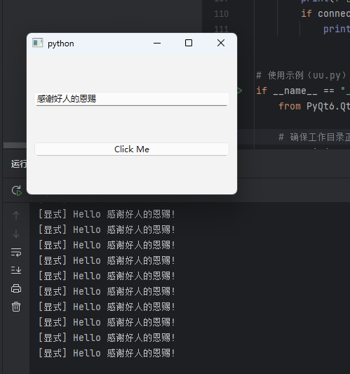

# qt-UILoader1.0
 ## 调用该工具的方法
 >只需要给一个.ui界面文件，会自动加载一个逻辑类与之匹配。
> 
   >你可以很方便的在逻辑类里写你的功能
> 
> 要用到什么组件只需要在逻辑类里声明变量。记得变量名必须要和ui里的objectName里的一样


### 案例：

**注意1：**
 >mainWindow.ui  和 mainWindow_logic.py必须在同一目录

**注意2：**
  >逻辑类的名字是ui文件名下划线加logic。 mainWindow_logic.py
>
**注意3：**
  >库用的是PyQt6
> 
 **更新日志2025年3月11日**
 >改进了事件的自动连接和显示连接。自动连接的命名规则是on_pushButton_clicked。由三部分构成on、_pushButton、_clicked。分别是：on开头，_pushButton组件的objectName，_clicked事件名称
### 1.mainWindow.ui 这是界面文件   

   ```xml
<?xml version="1.0" encoding="UTF-8"?>
<ui version="4.0">
 <class>MainWindow</class>
 <widget class="QMainWindow" name="MainWindow">
  <property name="geometry">
   <rect>
    <x>0</x>
    <y>0</y>
    <width>300</width>
    <height>200</height>
   </rect>
  </property>
  <widget class="QWidget" name="centralwidget">
   <layout class="QVBoxLayout">
    <item>
     <widget class="QLineEdit" name="lineEdit"/>
    </item>
    <item>
     <widget class="QPushButton" name="pushButton">
      <property name="text">
       <string>Click Me</string>
      </property>
     </widget>
    </item>
   </layout>
  </widget>
 </widget>
</ui>
```

### 2.在旁边建立一个mainWindow_logic.py文档。
   ```python
from PyQt6.QtWidgets import QPushButton, QLineEdit

class MainWindowLogic:
    pushButton: QPushButton  # 必须与UI中的objectName一致
    lineEdit: QLineEdit

    def setup_connections(self):
        """显式信号连接"""
        self.pushButton.clicked.connect(self.on_button_clicked)
        print("显式连接成功")

    def on_button_clicked(self):
        """按钮点击事件处理"""
        text = self.lineEdit.text() or "World"
        print(f"[显式] Hello {text}!")

    def pushButton_clicked(self):
        """自动连接事件（命名规范：组件名_信号名）"""
        print("[自动] 按钮点击事件通过命名规范连接成功")
```

### 3 调用

```python

if __name__ == "__main__":
    from PyQt6.QtWidgets import QApplication

    # 确保工作目录正确（如果从父目录运行）
    os.chdir(os.path.dirname(__file__))

    app = QApplication([])

    # 使用相对路径示例
    loader = UILoader("mainWindow.ui")  # UI文件在子目录test1中
    window, logic = loader.load()
    window.show()

    app.exec()

```